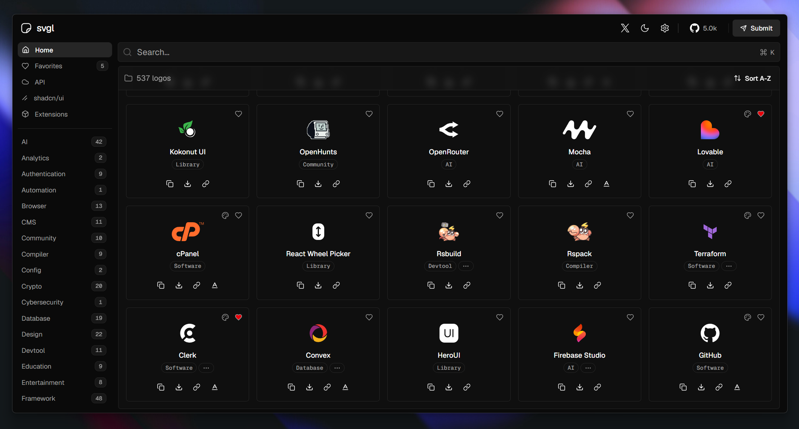

<div align="center">
<a href="https://svgl.app">

</a>
<p></p>
</div>

<div align="center">
    <a href="https://svgl.app" target="_blank">
        Explore
    </a>
    <span>&nbsp;✦&nbsp;</span>
    <a href="https://github.com/sponsors/pheralb">
        Sponsor this project
    </a>
    <span>&nbsp;✦&nbsp;</span>
    <a href="#-getting-started">
        Getting Started
    </a>
    <span>&nbsp;✦&nbsp;</span>
    <a href="https://svgl.app/extensions" target="_blank">
        Extensions
    </a>
    <span>&nbsp;✦&nbsp;</span>
    <a href="#️-stack">
        Stack
    </a>
    <span>&nbsp;✦&nbsp;</span>
    <a href="#️-contributing">
        Contributing
    </a>
    <span>&nbsp;✦&nbsp;</span>
    <a href="#️-license">
        License
    </a>
</div>

</p>

<div align="center">


[](https://actions-badge.atrox.dev/pheralb/svgl/goto?ref=main)


</div>

## 📦 Extensions

A list of extensions that use the [**SVGL API**](https://svgl.app/docs/api), created by the community:

|                                                                                                            | Extension              | Description                                                                                                | Created by                                                     | Link                                                                                             |
| ---------------------------------------------------------------------------------------------------------- | ---------------------- | ---------------------------------------------------------------------------------------------------------- | -------------------------------------------------------------- | ------------------------------------------------------------------------------------------------ |
|                 | SVGL CLI               | A CLI for easily adding SVG icons to your project.                                                         | [sujjeee](https://twitter.com/sujjeeee)                        | [GitHub Repository](https://github.com/sujjeee/svgls)                                            |
|          | SVGL for Framer        | Our SVGL plugin for Framer simplifies the use of SVG-based colourful logos. Easily import and easy to use. | [Krishna Singh](https://x.com/krishnasinghdev)                 | [Framer Marketplace](https://www.framer.com/marketplace/plugins/svgl/)                           |
|          | SVGL for React         | An open-source NPM package that offers a SVGL Logos for React.                                             | [ridemountainpig](https://x.com/ridemountainpig)               | [GitHub Repository](https://github.com/ridemountainpig/svgl-react?tab=readme-ov-file#svgl-react) |
|                  | SVGL for Vue           | An open-source NPM package that offers a SVGL Logos for Vue.                                               | [selemondev](https://x.com/selemondev)                         | [GitHub Repository](https://github.com/selemondev/svgl-vue?tab=readme-ov-file#--svgl-vue--)      |
|               | SVGL for Svelte        | An open-source NPM package that offers a SVGL Logos for Svelte.                                            | [selemondev](https://x.com/selemondev)                         | [GitHub Repository](https://github.com/selemondev/svgl-svelte#--svgl-svelte--)                   |
|                | SVGL for Figma         | Add svgs from svgl to your Figma project.                                                                  | [quilljou](https://twitter.com/quillzhou)                      | [Figma Plugin](https://www.figma.com/community/plugin/1320306989350693206/svgl)                  |
|            | SVGL for PowerToys     | Search & copy SVG logos in PowerToys Run.                                                                  | [SameerJS6](https://x.com/Sameerjs6)                           | [Website](https://svgl.sameerjs.com/)                                                            |
|              | SVGL for Raycast       | Search SVG logos via svgl.                                                                                 | [1weiho](https://twitter.com/1weiho)                           | [Raycast Store](https://www.raycast.com/1weiho/svgl)                                             |
|               | SVGL for VSCode        | SVGL directly in your VSCode.                                                                              | [girlazote](https://twitter.com/girlazote)                     | [VSCode Marketplace](https://marketplace.visualstudio.com/items?itemName=EsteveSegura.svgl)      |
|                        | SVGL Badge             | A beautiful badges with svgl SVG logos.                                                                    | [ridemountainpig](https://twitter.com/ridemountainpig)         | [Website](https://svgl-badge.vercel.app/)                                                        |
|  | Magic                  | AI extension for Cursor & other IDEs                                                                       | [serafimcloud](https://x.com/serafimcloud)                     | [Website](https://21st.dev/magic)                                                                |
|                                                    | SVGL for PowerShell    | PowerShell extension to quickly get svgl logos anywhere                                                    | [Bart Spaans](https://bsky.app/profile/bartspaans.bsky.social) | [GitHub Repository](https://github.com/spaansba/SVGL-PowerShell)                                 |
|                                                    | SVGL for Flow Launcher | Search & copy SVG logos in Flow Launcher                                                                   | [AF_Askar](https://x.com/Askar_AF)                             | [GitHub Repository](https://github.com/abo3skr2019/SVGl-plugin)                                  |

## 🛠️ Stack

- [**Sveltekit** + **Svelte 5**](https://kit.svelte.dev/) - Web development, streamlined.
- [**Typescript**](https://www.typescriptlang.org/) - JavaScript with syntax for types.
- [**Content-Collections**](https://www.content-collections.dev/) - Transform your content into type-safe data collections and say goodbye to manual data fetching and parsing.
- [**Shiki**](https://github.com/shikijs/shiki) - A beautiful Syntax Highlighter.
- [**Tailwind CSS**](https://tailwindcss.com/) - A utility-first CSS framework for rapidly building custom designs.
- [**bits-ui**](https://www.bits-ui.com) - A collection of headless components for Svelte.
- [**clsx**](https://github.com/lukeed/clsx) + [**tailwind-merge**](https://github.com/dcastil/tailwind-merge) inspired by [shadcn/ui](https://ui.shadcn.com) - A tiny utility for constructing `className` strings conditionally.
- [**Prettier**](https://prettier.io/) + [prettier-plugin-tailwindcss](https://github.com/tailwindlabs/prettier-plugin-tailwindcss) - An opinionated code formatter.
- [**Lucide Icons**](https://lucide.dev/) - Beautiful &
  consistent icons.
- [**svelte-sonner**](https://github.com/wobsoriano/svelte-sonner) - An opinionated toast component for Svelte.
- [**Hono**](https://hono.dev/) - Fast, lightweight, built on Web Standards. Support for any JavaScript runtime.
- [**@upstash/redis** + **@upstash/ratelimit**](https://upstash.com/) - Serverless Redis for developers.

## 🚀 Getting Started

> [!IMPORTANT]
> Before submitting an SVG, ensure you have the right to use it and that its license permits adding it to svgl. If you are uncertain, please contact the author or the company.

You will need:

- [Node.js 20+](https://nodejs.org/en/).
- [Git](https://git-scm.com/).

1. [**Fork this repository**](https://github.com/pheralb/svgl/fork) and clone it locally:

```bash
git clone git@github.com:your_username/svgl.git
```

2. Install dependencies:

```bash
# Install pnpm globally if you don't have it:
npm install -g pnpm

# and install dependencies:
pnpm install
```

3. Go to the [**`static/library`**](https://github.com/pheralb/svgl/blob/main/static/library) folder and add your `.svg` logo.

> [!WARNING]
>
> - Remember to optimize SVG for web, you can use [SVGOMG](https://jakearchibald.github.io/svgomg/).
> - When you optimize the SVG, make sure that the `viewBox` is not removed.
> - The size limit for each .svg is **21kb**.

4. Go to the [**`src/data/svgs.ts`**](https://github.com/pheralb/svgl/blob/main/src/data/svgs.ts) and add the information about your logo, following the structure:

- **Simple logo**:

```ts
{
  title: 'Title',
  category: 'Category',
  route: '/library/your_logo.svg',
  url: 'Website'
}
```

- **Simple logo + wordmark**:

```ts
{
  title: 'Title',
  category: 'Category',
  route: '/library/your_logo.svg',
  wordmark: '/library/your_logo_wordmark.svg',
  url: 'Website'
}
```

- **Logo (light & dark mode)**:

```ts
{
  title: 'Title',
  category: 'Category',
  route: {
    light: '/library/your_logo_light.svg',
    dark: '/library/your_logo_dark.svg'
  },
  url: 'Website'
}
```

- **Wordmark (light & dark mode)**:

```ts
{
  title: 'Title',
  category: 'Category',
  wordmark: {
    light: '/library/your_logo_light.svg',
    dark: '/library/your_logo_dark.svg'
  },
  url: 'Website'
}
```

- **Full example with all properties**:

```ts
{
  title: 'Title',
  category: 'Category',
  route: {
    light: '/library/your_logo_light.svg',
    dark: '/library/your_logo_dark.svg'
  },
  wordmark: {
    light: '/library/your_logo_wordmark_light.svg',
    dark: '/library/your_logo_wordmark_dark.svg'
  },
  url: 'Website'
}
```

- **Add brand guidelines** (where to find the images, how to use it, colors, fonts...):

```ts
{
  title: 'Title',
  category: 'Category',
  route: '/library/your_logo.svg',
  wordmark: '/library/your_logo_wordmark.svg',
  brandUrl: 'https://assets.website.com/brand-guidelines',
  url: 'Website'
}
```

> [!NOTE]
>
> - The list of categories is here: [`src/types/categories.ts`](https://github.com/pheralb/svgl/blob/main/src/types/categories.ts). You can add a new category if you need it.
> - You can add multiple categories to the same logo, for example: `category: ['Social', 'Design']`.

And create a pull request with your logo ✨.

## 🧑‍🚀 Getting Started with API

> [!WARNING]
> This section is how to run API locally. For all API endpoints, check the [**API documentation**](https://svgl.app/api).

1. Go to the [**`api-routes`**](https://github.com/pheralb/svgl/tree/main/api-routes) folder and install the dependencies with [pnpm](https://pnpm.io/):

```bash
cd api-routes
pnpm install
```

2. Create a `.dev.vars` env file in the `api-routes` folder with the following variables:

```bash
# .dev.vars
SVGL_API_REQUESTS = 1
UPSTASH_REDIS_URL = ""
UPSTASH_REDIS_TOKEN = ""
```

- [Create a Upstash account](https://console.upstash.com/).
- [Create a Upstash Redis Database](https://upstash.com/docs/redis/overall/getstarted).

3. Run the development server:

```bash
pnpm dev
```

## ✌️ Contributing

<a href="https://github.com/pheralb/svgl/graphs/contributors">
  
</a>

<p></p>

## 🔑 License

- [MIT](https://github.com/pheralb/svgl/blob/main/LICENSE).
