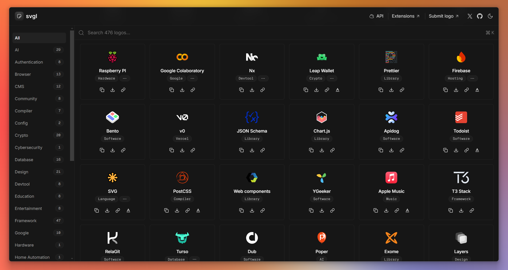

<div align="center">
<a href="https://svgl.app">

</a>
<p></p>
</div>

<div align="center">
    <a href="https://svgl.app" target="_blank">
        Discover
    </a>
    <span>&nbsp;✦&nbsp;</span>
    <a href="https://github.com/pheralb/svgl/issues/new?assignees=pheralb&labels=request&projects=&template=request-svg-.md&title=%5BRequest%5D%3A">
        Request logo
    </a>
    <span>&nbsp;✦&nbsp;</span>
    <a href="#-getting-started">
        Submit logo
    </a>
    <span>&nbsp;✦&nbsp;</span>
    <a href="#-extensions">
        Extensions
    </a>
    <span>&nbsp;✦&nbsp;</span>
    <a href="https://svgl.app/api">
        API
    </a>
    <span>&nbsp;✦&nbsp;</span>
    <a href="#%EF%B8%8F-contributing">
        Contributing
    </a>
</div>

</p>

<div align="center">


[](https://actions-badge.atrox.dev/pheralb/svgl/goto?ref=main)


</div>

## 🛠️ Stack

- [**Sveltekit**](https://kit.svelte.dev/) - Web development, streamlined.
- [**Typescript**](https://www.typescriptlang.org/) - JavaScript with syntax for types.
- [**mdsvex**](https://mdsvex.com/) - Markdown for Svelte apps.
- [**Shiki**](https://github.com/shikijs/shiki) - A beautiful Syntax Highlighter.
- [**Tailwindcss**](https://tailwindcss.com/) - A utility-first CSS framework for rapidly building custom designs.
- [**bits-ui**](https://www.bits-ui.com) - A collection of headless components for Svelte.
- [**clsx**](https://github.com/lukeed/clsx) + [**tailwind-merge**](https://github.com/dcastil/tailwind-merge) inspired by [shadcn/ui](https://ui.shadcn.com) - A tiny utility for constructing `className` strings conditionally.
- [**Prettier**](https://prettier.io/) + [prettier-plugin-tailwindcss](https://github.com/tailwindlabs/prettier-plugin-tailwindcss) - An opinionated code formatter.
- [**Lucide Icons**](https://lucide.dev/) + [**phosphor-svelte**](https://github.com/haruaki07/phosphor-svelte) - A clean and friendly icons libraries.
- [**svelte-sonner**](https://github.com/wobsoriano/svelte-sonner) - An opinionated toast component for Svelte.
- [**@upstash/redis** + **@upstash/ratelimit**](https://upstash.com/) - Serverless Redis for developers.
- [**Vitest**](https://vitest.dev/) - Blazing Fast Unit Test Framework.

## 🚀 Getting Started

> [!IMPORTANT]
> Before submitting the SVG, **make sure that you have permission** or that the license of the SVG allows you to add it to svgl. If you are not sure, please contact the company or author.

You will need:

- [Node.js 16+ (recommended 18 LTS)](https://nodejs.org/en/).
- [Git](https://git-scm.com/).

1. [Fork](https://github.com/pheralb/svgl/fork) this repository and clone it locally:

```bash
git clone git@github.com:your_username/svgl.git
```

2. Install dependencies:

```bash
# Install pnpm globally if you don't have it:
npm install -g pnpm

# and install dependencies:
pnpm install
```

3. Go to the [**`static/library`**](https://github.com/pheralb/svgl/blob/main/static/library) folder and add your `.svg` logo.

> [!WARNING]
>
> - Remember to optimize SVG for web, you can use [SVGOMG](https://jakearchibald.github.io/svgomg/).
> - When you optimize the SVG, make sure that the `viewBox` is not removed.
> - The size limit for each .svg is **20kb**.

4. Go to the [**`src/data/svgs.ts`**](https://github.com/pheralb/svgl/blob/main/src/data/svgs.ts) and add the information about your logo, following the structure:

- If the logo is a solid color:

```json
{
  "title": "Title",
  "category": "Category",
  "route": "/library/your_logo.svg",
  "url": "Website"
}
```

- If the logo has logo + wordmark version:

```json
{
  "title": "Title",
  "category": "Category",
  "route": "/library/your_logo.svg",
  "wordmark": "/library/your_logo_wordmark.svg",
  "url": "Website"
}
```

- If the logo/wordmark has light and dark mode:

```json
{
  "title": "Title",
  "category": "Category",
  "route": {
    "light": "/library/your_logo_light.svg",
    "dark": "/library/your_logo_dark.svg"
  },
  "wordmark": {
    "light": "/library/your_wordmark-logo_light.svg",
    "dark": "/library/your_wordmark-logo_dark.svg"
  },
  "url": "Website"
}
```

> [!NOTE]
>
> - The list of categories is here: [`src/types/categories.ts`](https://github.com/pheralb/svgl/blob/main/src/types/categories.ts). You can add a new category if you need it.
> - You can add multiple categories to the same logo, for example: `"category": ["Social", "Design"]` (max 3 categories per logo).

And create a pull request with your logo 🚀.

5. (Optional) If you want to run the [API](https://svgl.app/api) locally, you will need to create a `.env` file in the root of the project with the following variables:

- [Create a Upstash account](https://console.upstash.com/).
- [Create a Upstash Redis Database](https://upstash.com/docs/redis/overall/getstarted).

```bash
SVGL_API_REQUESTS = 1
UPSTASH_REDIS_URL = ""
UPSTASH_REDIS_TOKEN = ""
```

## 📦 Extensions

A list of extensions that use the [svgl API](https://svgl.app/api), created by the community:

|                                                                                                | Extension        | Description                                        | Created by                                | Link                                                                            |
| ---------------------------------------------------------------------------------------------- | ---------------- | -------------------------------------------------- | ----------------------------------------- | ------------------------------------------------------------------------------- |
|     | svgls            | A CLI for easily adding SVG icons to your project. | [sujjeee](https://twitter.com/sujjeeee)   | [Github Repository](https://github.com/sujjeee/svgls)                           |
|    | SVGL for Figma   | Add svgs from svgl to your Figma project.          | [quilljou](https://twitter.com/quillzhou) | [Figma Plugin](https://www.figma.com/community/plugin/1320306989350693206/svgl) |
|  | SVGL for Raycast | Search SVG logos via svgl.                         | [1weiho](https://twitter.com/1weiho)      | [Raycast Store](https://www.raycast.com/1weiho/svgl)                       |

## ✌️ Contributing

<a href="https://github.com/pheralb/svgl/graphs/contributors">
  
</a>

<p></p>

## 🔑 License

- [MIT](https://github.com/pheralb/svgl/blob/main/LICENSE).
