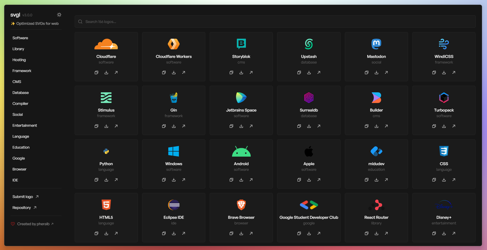

<div align="center">
<a href="https://svgl.vercel.app">

</a>
<p></p>
</div>

<div align="center">
    <a href="https://svgl.vercel.app/" target="_blank">
        Discover
    </a>
    <span>&nbsp;⁘&nbsp;</span>
    <a href="#-getting-started">
        Submit logo
    </a>
    <span>&nbsp;⁘&nbsp;</span>
    <a href="#%EF%B8%8F-stack">
        Stack
    </a>
    <span>&nbsp;⁘&nbsp;</span>
    <a href="#%EF%B8%8F-contributing">
        Contributing
    </a>
</div>

</p>

<div align="center">


[](https://actions-badge.atrox.dev/pheralb/svgl/goto?ref=main)


</div>

## 🛠️ Stack

- [**Sveltekit**](https://kit.svelte.dev/) - Web development, streamlined.
- [**Typescript**](https://www.typescriptlang.org/) - JavaScript with syntax for types.
- [**Tailwindcss**](https://tailwindcss.com/) - A utility-first CSS framework for rapidly building custom designs.
- [**Prettier**](https://prettier.io/) + [prettier-plugin-tailwindcss](https://github.com/tailwindlabs/prettier-plugin-tailwindcss) - An opinionated code formatter.
- [**phosphor-svelte**](https://github.com/haruaki07/phosphor-svelte) - A clean and friendly icon family for Svelte.
- [**svelte-sonner**](https://github.com/wobsoriano/svelte-sonner) - An opinionated toast component for Svelte.
- [**Vitest**](https://vitest.dev/) - Blazing Fast Unit Test Framework.

## 🚀 Getting Started

You will need:

- [Node.js 16+ (recommended 18 LTS)](https://nodejs.org/en/).
- [Git](https://git-scm.com/).

1. Clone or [fork](https://github.com/pheralb/svgl/fork) this repository:

```bash
git clone git@github.com:pheralb/svgl.git
```

2. Install dependencies with your favorite package manager:

```bash
# with npm:
npm install

# with pnpm:
pnpm install

# with ultra:
ultra install

# with yarn:
yarn install
```

3. Go to the [**`static/library`**](https://github.com/pheralb/svgl/blob/main/static/library) folder and add your `.svg` logo. Remember to optimize SVG for web use, you can use [SVGOMG](https://jakearchibald.github.io/svgomg/).

4. Go to the [**`src/data/svgs.ts`**](https://github.com/pheralb/svgl/blob/main/src/data/svgs.ts) and add the information about your logo, following the structure:

> [!IMPORTANT]
> To avoid conflicts with other svgs IDs, generate a short ``uuid`` for the id: [Generate](https://generateuuid.online/short-uuid).

```json
{
  "id": "28NcjLCRGMGz",
  "title": "Title",
  "category": "Category",
  "route": "/library/your_logo.svg",
  "url": "Website"
},
```

And create a pull request with your logo 🚀.

## ✌️ Contributing

<a href="https://github.com/pheralb/svgl/graphs/contributors">
  
</a>

<p></p>

## 🔑 License

- [MIT](https://github.com/pheralb/svgl/blob/main/LICENSE).
